# Family Relationships / خاندانی رشتے

Revision 6 — 2026-09-03

> Generated from `family.db`. Update the data file, then run `python3.11 build_family.py`.
> `family.md` and `family.html` are generated together from the same Mermaid diagram string.
>
> Reading guide:
> - Each married couple is one compact horizontal unit: spouses sit beside each other and the horizontal line between them is the marriage, with the recorded year where known.
> - Parent lines leave both actual parent cards, meet at a separate family junction, and fan out to the actual child cards; `parents / والدین` or `biological parents / حقیقی والدین` is written on the shared downward line.
> - A couple without recorded children has no child junction; `no children / کوئی اولاد نہیں` stays on the marriage line where recorded.
> - In this current master view, maternal-side pink units occupy the left and paternal-side blue units occupy the right. Irsa Naz + Mansoor Hussain remain the central bridge, using one pink card and one blue card inside a neutral boundary.
> - `[1]`, `[2]`, ... before a name record birth order within that sibling group.
> - Direct neutral dotted lines connect the existing person cards for other recorded sibling/cross-family relationships; the relationship wording appears on the line and person names are not repeated.
> - Derived cousin relationships (first/second cousin and once-removed terms with maternal/paternal sides) are calculated from biological links and full-sibling facts; they appear in the generated derived-relationships section, and a couple that is also a cousin pair gets a small annotation on its marriage line.

```mermaid
flowchart TB
  %% Generated from family.db by build_family.py. Source of truth: family.db.
  %% Current master layout: maternal left, bridge center, paternal right.
  %% Couple clusters are colored visual units only. Junctions (j_*) are
  %% layout-only helpers: not people and never written back to family.db.
  classDef person fill:#ffffff,stroke:#6b7280,color:#111111;
  classDef matperson fill:#FFE9EF,stroke:#DBA3B4,color:#111111;
  classDef patperson fill:#E1EEFF,stroke:#97B6DE,color:#111111;
  classDef focus stroke:#c62828,stroke-width:3px,color:#111111;
  classDef junc fill:none,stroke:none,color:none;
  classDef route fill:none,stroke:none,color:none;
    x_abrar_israr[" "]
  subgraph u_israr_hussain__shahnaz_israr[" "]
    direction LR
    p_israr_hussain["Israr Hussain<br/>Maternal grandfather / نانا"]
    p_shahnaz_israr["Shahnaz Israr<br/>Maternal grandmother / نانی"]
    p_israr_hussain ---|"married / شادی شدہ"| p_shahnaz_israr
  end
  subgraph u_abrar_hussain__shaheen_abrar[" "]
    direction LR
    p_abrar_hussain["Abrar Hussain<br/>Paternal grandfather / دادا"]
    p_shaheen_abrar["Shaheen Abrar<br/>Paternal grandmother / دادی"]
    p_abrar_hussain ---|"married / شادی شدہ"| p_shaheen_abrar
  end
  subgraph u_rubinna__sohaib_hussain[" "]
    direction LR
    p_rubinna["Rubinna<br/>Maternal uncle's wife / ممانی"]
    p_sohaib_hussain["[1] Sohaib Hussain<br/>Maternal uncle / ماموں"]
    p_rubinna ---|"married / شادی شدہ<br/>no children / کوئی اولاد نہیں"| p_sohaib_hussain
  end
  subgraph u_asif_qamar__sadia_asif[" "]
    direction LR
    p_asif_qamar["Asif Qamar<br/>Maternal aunt's husband / خالو"]
    p_sadia_asif["[2] Sadia Asif<br/>Maternal aunt / خالہ"]
    p_asif_qamar ---|"married / شادی شدہ"| p_sadia_asif
  end
  subgraph u_arsalan_israr__falak_naz[" "]
    direction LR
    p_arsalan_israr["[4] Arsalan Israr<br/>Maternal uncle / ماموں"]
    p_falak_naz["Falak Naz<br/>Maternal uncle's wife / ممانی"]
    p_arsalan_israr ---|"married / شادی شدہ<br/>no children / کوئی اولاد نہیں"| p_falak_naz
  end
  subgraph u_ayesha_naeem__wahaj[" "]
    direction LR
    p_ayesha_naeem["[5] Ayesha Naeem<br/>Maternal aunt / خالہ<br/>Given to another family after birth (exact arrangement not yet specified)<br/>پیدائش کے بعد دوسری فیملی کو دی گئیں (تفصیل ابھی غیر واضح ہے)"]
    p_wahaj["Wahaj<br/>Maternal aunt's husband / خالو"]
    p_ayesha_naeem ---|"married / شادی شدہ<br/>no children / کوئی اولاد نہیں"| p_wahaj
  end
  subgraph u_irsa_naz__mansoor_hussain[" "]
    direction LR
    p_irsa_naz["[3] Irsa Naz<br/>Mother / والدہ"]
    p_mansoor_hussain["[1] Mansoor Hussain<br/>Father / والد"]
    p_irsa_naz ---|"married 2003 / شادی 2003<br/>first cousins / پہلے کزن"| p_mansoor_hussain
  end
  subgraph u_hina__zubair[" "]
    direction LR
    p_hina["[2] Hina<br/>Paternal aunt / پھوپھی"]
    p_zubair["Zubair<br/>Paternal aunt's husband / پھوپھا"]
    p_hina ---|"married / شادی شدہ"| p_zubair
  end
  subgraph u_sajjad__sana[" "]
    direction LR
    p_sajjad["Sajjad<br/>Paternal aunt's husband / پھوپھا"]
    p_sana["[3] Sana<br/>Paternal aunt / پھوپھی"]
    p_sajjad ---|"married / شادی شدہ"| p_sana
  end
  subgraph u_adeel_ahmad__afshan[" "]
    direction LR
    p_adeel_ahmad["Adeel Ahmad<br/>Paternal aunt's husband / پھوپھا"]
    p_afshan["[4] Afshan<br/>Paternal aunt / پھوپھی"]
    p_adeel_ahmad ---|"married / شادی شدہ"| p_afshan
  end
  subgraph u_aresha_zubair__owais[" "]
    direction LR
    p_aresha_zubair["[1] Aresha Zubair<br/>Paternal cousin / پھوپھی زاد"]
    p_owais["Owais<br/>Paternal cousin's husband / پھوپھی زاد کے شوہر"]
    p_aresha_zubair ---|"married / شادی شدہ"| p_owais
  end
  subgraph u_fizza_zubair__moiz[" "]
    direction LR
    p_fizza_zubair["[2] Fizza Zubair<br/>Paternal cousin / پھوپھی زاد"]
    p_moiz["Moiz<br/>Paternal cousin's husband / پھوپھی زاد کے شوہر"]
    p_fizza_zubair ---|"married / شادی شدہ<br/>no children / کوئی اولاد نہیں"| p_moiz
  end
    j_israr_hussain__shahnaz_israr[" "]
    j_abrar_hussain__shaheen_abrar[" "]
    j_asif_qamar__sadia_asif[" "]
    j_irsa_naz__mansoor_hussain[" "]
    j_hina__zubair[" "]
    j_sajjad__sana[" "]
    j_adeel_ahmad__afshan[" "]
    j_aresha_zubair__owais[" "]
    x_rubinna_falak[" "]
    x_aresha_children[" "]
    p_ezan_asif["[1] Ezan Asif (2003)<br/>Maternal cousin / خالہ زاد بھائی"]
    p_fakhir_asif["[2] Fakhir Asif (2007)<br/>Maternal cousin / خالہ زاد بھائی"]
    p_mohammad_yahya_hussain["[1] Mohammad Yahya Hussain (2004)<br/>Self / خود"]
    p_maham_mansoor["[2] Maham Mansoor (2006)<br/>Sister / بہن"]
    p_abdul_rafey["[3] Abdul Rafey (2003)<br/>Paternal cousin / پھوپھی زاد بھائی<br/>Single / غیر شادی شدہ"]
    p_muaaz["[1] Muaaz / Maaz (2010)<br/>Paternal cousin / پھوپھی زاد بھائی"]
    p_barirah["[2] Barirah (2015)<br/>Paternal cousin / پھوپھی زاد بہن"]
    p_musabiha["[1] Musabiha<br/>Paternal cousin / پھوپھی زاد بہن"]
    p_musa["[2] Musa<br/>Paternal cousin / پھوپھی زاد بھائی"]
    p_aresha_owais_daughter_a["Unnamed daughter A<br/>Cousin's daughter / کزن کی بیٹی<br/>A is an identifier, not a birth-order claim<br/>A صرف شناخت ہے، پیدائشی ترتیب نہیں"]
    p_aresha_owais_daughter_b["Unnamed daughter B<br/>Cousin's daughter / کزن کی بیٹی<br/>B is an identifier, not a birth-order claim<br/>B صرف شناخت ہے، پیدائشی ترتیب نہیں"]

    u_israr_hussain__shahnaz_israr -->|"biological parents / حقیقی والدین"| j_israr_hussain__shahnaz_israr
    j_israr_hussain__shahnaz_israr --> u_rubinna__sohaib_hussain
    j_israr_hussain__shahnaz_israr --> u_arsalan_israr__falak_naz
    j_israr_hussain__shahnaz_israr --> u_asif_qamar__sadia_asif
    j_israr_hussain__shahnaz_israr --> u_ayesha_naeem__wahaj
    j_israr_hussain__shahnaz_israr --> u_irsa_naz__mansoor_hussain
    u_abrar_hussain__shaheen_abrar -->|"biological parents / حقیقی والدین"| j_abrar_hussain__shaheen_abrar
    j_abrar_hussain__shaheen_abrar --> u_irsa_naz__mansoor_hussain
    j_abrar_hussain__shaheen_abrar --> u_hina__zubair
    j_abrar_hussain__shaheen_abrar --> u_sajjad__sana
    j_abrar_hussain__shaheen_abrar --> u_adeel_ahmad__afshan
    u_asif_qamar__sadia_asif -->|"biological parents / حقیقی والدین"| j_asif_qamar__sadia_asif
    j_asif_qamar__sadia_asif --> p_ezan_asif
    j_asif_qamar__sadia_asif --> p_fakhir_asif
    u_irsa_naz__mansoor_hussain -->|"biological parents / حقیقی والدین"| j_irsa_naz__mansoor_hussain
    j_irsa_naz__mansoor_hussain --> p_mohammad_yahya_hussain
    j_irsa_naz__mansoor_hussain --> p_maham_mansoor
    u_hina__zubair -->|"biological parents / حقیقی والدین"| j_hina__zubair
    j_hina__zubair --> u_aresha_zubair__owais
    j_hina__zubair --> u_fizza_zubair__moiz
    j_hina__zubair --> p_abdul_rafey
    u_sajjad__sana -->|"biological parents / حقیقی والدین"| j_sajjad__sana
    j_sajjad__sana --> p_muaaz
    j_sajjad__sana --> p_barirah
    u_adeel_ahmad__afshan -->|"biological parents / حقیقی والدین"| j_adeel_ahmad__afshan
    j_adeel_ahmad__afshan --> p_musabiha
    j_adeel_ahmad__afshan --> p_musa
    u_aresha_zubair__owais -->|"biological parents / حقیقی والدین"| j_aresha_zubair__owais
    j_aresha_zubair__owais --> p_aresha_owais_daughter_a
    j_aresha_zubair__owais --> p_aresha_owais_daughter_b
    x_abrar_israr -. "full brothers / سگے بھائی" .- u_israr_hussain__shahnaz_israr
    x_abrar_israr -.- u_abrar_hussain__shaheen_abrar
    u_rubinna__sohaib_hussain -. "full sisters / سگی بہنیں" .- x_rubinna_falak
    u_arsalan_israr__falak_naz -.- x_rubinna_falak
    p_aresha_owais_daughter_a -. "sisters; order not stated / بہنیں؛ ترتیب نامعلوم" .- x_aresha_children
    p_aresha_owais_daughter_b -.- x_aresha_children

    class p_mohammad_yahya_hussain person;
    class p_mohammad_yahya_hussain focus;
    class p_maham_mansoor person;
    class p_shahnaz_israr person;
    class p_israr_hussain person;
    class p_sohaib_hussain person;
    class p_rubinna person;
    class p_sadia_asif person;
    class p_asif_qamar person;
    class p_ezan_asif person;
    class p_fakhir_asif person;
    class p_arsalan_israr person;
    class p_falak_naz person;
    class p_ayesha_naeem person;
    class p_wahaj person;
    class p_abrar_hussain person;
    class p_shaheen_abrar person;
    class p_hina person;
    class p_zubair person;
    class p_aresha_zubair person;
    class p_owais person;
    class p_aresha_owais_daughter_a person;
    class p_aresha_owais_daughter_b person;
    class p_fizza_zubair person;
    class p_moiz person;
    class p_abdul_rafey person;
    class p_sana person;
    class p_sajjad person;
    class p_muaaz person;
    class p_barirah person;
    class p_afshan person;
    class p_adeel_ahmad person;
    class p_musabiha person;
    class p_musa person;
    style u_israr_hussain__shahnaz_israr fill:#FFF5F7,stroke:#E0B0BD,color:#111111;
    style u_abrar_hussain__shaheen_abrar fill:#EEF4FF,stroke:#A8C3E6,color:#111111;
    style u_rubinna__sohaib_hussain fill:#FFE9EF,stroke:#DBA3B4,color:#111111;
    style u_asif_qamar__sadia_asif fill:#FFE1EA,stroke:#D88BA5,color:#111111;
    style u_arsalan_israr__falak_naz fill:#F7E3E8,stroke:#C992A3,color:#111111;
    style u_ayesha_naeem__wahaj fill:#FFF0EA,stroke:#DCA18E,color:#111111;
    class p_irsa_naz matperson;
    class p_mansoor_hussain patperson;
    style u_irsa_naz__mansoor_hussain fill:#F7F7FA,stroke:#B4B4CC,color:#111111;
    style u_hina__zubair fill:#E1EEFF,stroke:#97B6DE,color:#111111;
    style u_sajjad__sana fill:#ECF0F7,stroke:#A5B2C7,color:#111111;
    style u_adeel_ahmad__afshan fill:#E0F2F5,stroke:#8EBECB,color:#111111;
    style u_aresha_zubair__owais fill:#E3F1F8,stroke:#8FBBD5,color:#111111;
    style u_fizza_zubair__moiz fill:#E7EDF6,stroke:#9FB3CD,color:#111111;
    class j_israr_hussain__shahnaz_israr junc;
    class j_abrar_hussain__shaheen_abrar junc;
    class j_asif_qamar__sadia_asif junc;
    class j_irsa_naz__mansoor_hussain junc;
    class j_hina__zubair junc;
    class j_sajjad__sana junc;
    class j_adeel_ahmad__afshan junc;
    class j_aresha_zubair__owais junc;
    class x_rubinna_falak route;
    class x_abrar_israr route;
    class x_aresha_children route;
```

## Derived cousin relationships / اخذ کردہ کزن رشتے

Calculated from the biological parent-child graph and full-sibling facts in family.db; these are not stored as user-stated facts.

Side labels (maternal / paternal) show which of the focus person's parents the path runs through. Simple terms: first cousin / پہلے کزن، second cousin / دوسرے کزن.

### For Mohammad Yahya Hussain (focus) / مرکزی شخص کے لیے

- **Maham Mansoor** — maternal second cousin; paternal second cousin
- **Irsa Naz** — paternal first cousin once removed
- **Mansoor Hussain** — maternal first cousin once removed
- **Sohaib Hussain** — paternal first cousin once removed
- **Sadia Asif** — paternal first cousin once removed
- **Ezan Asif** — maternal first cousin; paternal second cousin
- **Fakhir Asif** — maternal first cousin; paternal second cousin
- **Arsalan Israr** — paternal first cousin once removed
- **Ayesha Naeem** — paternal first cousin once removed
- **Hina** — maternal first cousin once removed
- **Aresha Zubair** — paternal first cousin; maternal second cousin
- **Unnamed daughter A** — paternal first cousin once removed; maternal second cousin once removed
- **Unnamed daughter B** — paternal first cousin once removed; maternal second cousin once removed
- **Fizza Zubair** — paternal first cousin; maternal second cousin
- **Abdul Rafey** — paternal first cousin; maternal second cousin
- **Sana** — maternal first cousin once removed
- **Muaaz** — paternal first cousin; maternal second cousin
- **Barirah** — paternal first cousin; maternal second cousin
- **Afshan** — maternal first cousin once removed
- **Musabiha** — paternal first cousin; maternal second cousin
- **Musa** — paternal first cousin; maternal second cousin

## Open review notes / زیرِ جائزہ نکات

- None / کوئی نہیں

## Deferred / on-hold items / زیرِ التوا

- **R9** — Whether Shahnaz Israr and Shaheen Abrar have any relationship to each other is ON HOLD. No relationship is inferred, neither person is removed, and this is not asked again during the current revision.

## Preserved placeholders / محفوظ نامکمل معلومات

- **R5** — Aresha and Owais's two daughters remain Unnamed daughter A and B until their names and birth order are provided. A/B do not assert birth order.
- **R6** — Ayesha's arrangement with the other family remains an unspecified placeholder. No legal status is inferred.

## Validation summary

- People: 35
- Parent-child facts: 44
- Marriages: 12
- Sibling groups: 10
- Duplicate IDs, missing references, duplicate edges, and ancestry cycles: checked
- Parent kinds, marital status, marriage children_status, sibling-group types, and no-children conflicts: checked
- Derived cousin relationships: calculated from the explicit graph and audited at build time
